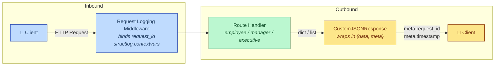

```mermaid
flowchart LR
    subgraph Request["Inbound"]
        C["📱 Client"] -->|"HTTP Request"| MW["Request Logging Middleware<br/><i>binds request_id</i><br/><i>structlog.contextvars</i>"]
    end

    MW --> H["Route Handler<br/><i>employee / manager / executive</i>"]

    subgraph Response["Outbound"]
        H -->|"dict / list"| ResponseWrapper["CustomJSONResponse<br/><i>wraps in {data, meta}</i>"]
        ResponseWrapper -->|"meta.request_id<br/>meta.timestamp"| R["📱 Client"]
    end

    classDef request fill:#bfdbfe,stroke:#1e40af,color:#1e3a5f
    classDef handler fill:#bbf7d0,stroke:#166534,color:#14532d
    classDef response fill:#fde68a,stroke:#92400e,color:#78350f
    classDef middleware fill:#fed7aa,stroke:#9a3412,color:#7c2d12

    class C,MW request
    class H handler
    class ResponseWrapper,R response
```
