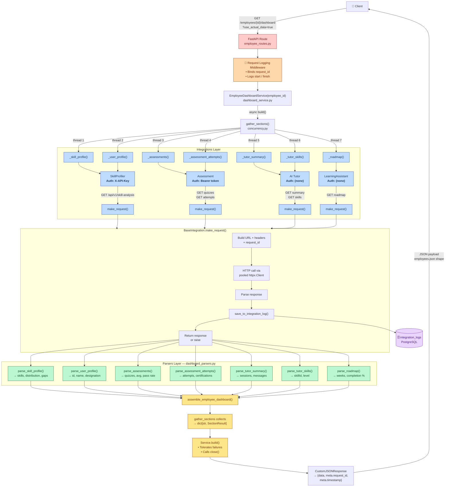

```mermaid
flowchart TD
    Client["📱 Client"] -->|"GET /employees/{id}/dashboard<br/>?use_actual_data=true"| Route["FastAPI Route<br/>employee_routes.py"]

    Route --> LoggerMW["🔐 Request Logging Middleware<br/>• Binds request_id<br/>• Logs start / finish"]

    LoggerMW --> Service["EmployeeDashboardService(employee_id)<br/>dashboard_service.py"]
    Service -->|"async build()"| Gather["gather_sections()<br/>concurrency.py"]

    Gather -->|"thread 1"| SP1["_skill_profile()"]
    Gather -->|"thread 2"| SP2["_user_profile()"]
    Gather -->|"thread 3"| Asmt1["_assessments()"]
    Gather -->|"thread 4"| Asmt2["_assessment_attempts()"]
    Gather -->|"thread 5"| Tutor1["_tutor_summary()"]
    Gather -->|"thread 6"| Tutor2["_tutor_skills()"]
    Gather -->|"thread 7"| Roadmap["_roadmap()"]

    subgraph Integrations["Integrations Layer"]
        SP1 --> SkillProfiler["SkillProfiler<br/><b>Auth: X-API-Key</b>"]
        SP2 --> SkillProfiler
        SkillProfiler -->|"GET /api/v1/skill-analysis"| MakeReqSP["make_request()"]

        Asmt1 --> Assessment["Assessment<br/><b>Auth: Bearer token</b>"]
        Asmt2 --> Assessment
        Assessment -->|"GET quizzes<br/>GET attempts"| MakeReqAsmt["make_request()"]

        Tutor1 --> AITutor["AI Tutor<br/><b>Auth: (none)</b>"]
        Tutor2 --> AITutor
        AITutor -->|"GET summary<br/>GET skills"| MakeReqTutor["make_request()"]

        Roadmap --> LearningAsst["LearningAssistant<br/><b>Auth: (none)</b>"]
        LearningAsst -->|"GET roadmap"| MakeReqLA["make_request()"]
    end

    subgraph MakeRequest["BaseIntegration.make_request()"]
        direction TB
        MR1["Build URL + headers<br/>+ request_id"]
        MR2["HTTP call via<br/>pooled httpx.Client"]
        MR3["Parse response"]
        MR4["save_to_integration_log()"]
        MR5["Return response<br/>or raise"]

        MR1 --> MR2 --> MR3 --> MR4 --> MR5
    end

    MakeReqSP --> MakeRequest
    MakeReqAsmt --> MakeRequest
    MakeReqTutor --> MakeRequest
    MakeReqLA --> MakeRequest

    MR4 --> DBLog[("🗄️ integration_logs<br/>PostgreSQL")]

    subgraph Parsers["Parsers Layer — dashboard_parsers.py"]
        P_SP["parse_skill_profile()<br/>→ skills, distribution, gaps"]
        P_UP["parse_user_profile()<br/>→ id, name, designation"]
        P_Asmt["parse_assessments()<br/>→ quizzes, avg, pass rate"]
        P_AA["parse_assessment_attempts()<br/>→ attempts, certifications"]
        P_TS["parse_tutor_summary()<br/>→ sessions, messages"]
        P_TSk["parse_tutor_skills()<br/>→ skillId, level"]
        P_RM["parse_roadmap()<br/>→ weeks, completion %"]
    end

    MR5 --> P_SP & P_UP & P_Asmt & P_AA & P_TS & P_TSk & P_RM

    P_SP & P_UP & P_Asmt & P_AA & P_TS & P_TSk & P_RM --> Assembler["assemble_employee_dashboard()"]
    Assembler --> SectionCollect["gather_sections collects<br/>→ dict[str, SectionResult]"]
    SectionCollect --> Build["Service.build()<br/>• Tolerates failures<br/>• Calls close()"]

    Build --> Response["CustomJSONResponse<br/>→ {data, meta.request_id,<br/>meta.timestamp}"]

    Response -->|"JSON payload<br/>employees.json shape"| Client

    classDef integration fill:#bfdbfe,stroke:#1e40af,color:#1e3a5f
    classDef parser fill:#bbf7d0,stroke:#166534,color:#14532d
    classDef assembler fill:#fde68a,stroke:#92400e,color:#78350f
    classDef db fill:#e9d5ff,stroke:#6b21a8,color:#4c1d95
    classDef route fill:#fecaca,stroke:#991b1b,color:#7f1d1d
    classDef middleware fill:#fed7aa,stroke:#9a3412,color:#7c2d12

    class SP1,SP2,SkillProfiler,MakeReqSP integration
    class Asmt1,Asmt2,Assessment,MakeReqAsmt integration
    class Tutor1,Tutor2,AITutor,MakeReqTutor integration
    class Roadmap,LearningAsst,MakeReqLA integration
    class P_SP,P_UP,P_Asmt,P_AA,P_TS,P_TSk,P_RM parser
    class Assembler,SectionCollect,Build assembler
    class DBLog db
    class Route route
    class LoggerMW middleware
```
