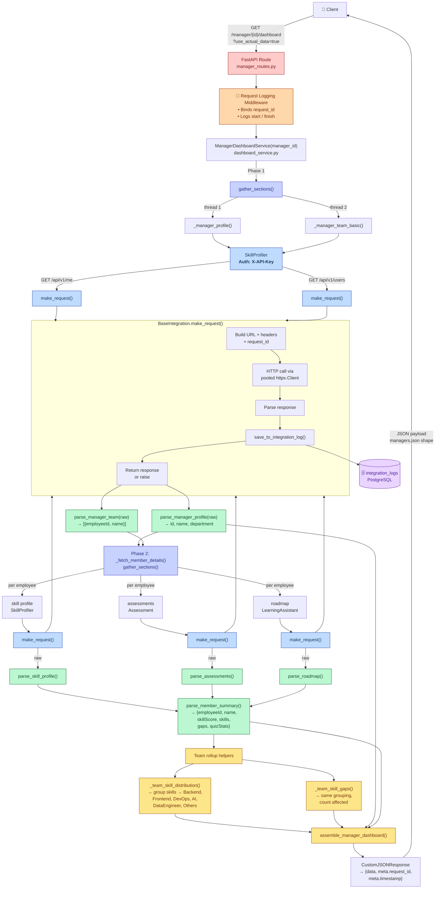

```mermaid
flowchart TD
    Client["📱 Client"] -->|"GET /manager/{id}/dashboard<br/>?use_actual_data=true"| Route["FastAPI Route<br/>manager_routes.py"]

    Route --> LoggerMW["🔐 Request Logging Middleware<br/>• Binds request_id<br/>• Logs start / finish"]

    LoggerMW --> Service["ManagerDashboardService(manager_id)<br/>dashboard_service.py"]

    Service -->|"Phase 1"| Gather1["gather_sections()"]

    Gather1 -->|"thread 1"| MgrProfile["_manager_profile()"]
    Gather1 -->|"thread 2"| TeamBasic["_manager_team_basic()"]

    MgrProfile --> SkillProfiler1["SkillProfiler<br/><b>Auth: X-API-Key</b>"]
    TeamBasic --> SkillProfiler1
    SkillProfiler1 -->|"GET /api/v1/me"| Req1["make_request()"]
    SkillProfiler1 -->|"GET /api/v1/users"| Req2["make_request()"]

    subgraph MakeRequest["BaseIntegration.make_request()"]
        direction TB
        MR1["Build URL + headers<br/>+ request_id"]
        MR2["HTTP call via<br/>pooled httpx.Client"]
        MR3["Parse response"]
        MR4["save_to_integration_log()"]
        MR5["Return response<br/>or raise"]
        MR1 --> MR2 --> MR3 --> MR4 --> MR5
    end

    Req1 --> MakeRequest
    Req2 --> MakeRequest

    MR4 --> DBLog[("🗄️ integration_logs<br/>PostgreSQL")]

    MR5 --> P_Mgr["parse_manager_profile(raw)<br/>→ id, name, department"]
    MR5 --> P_Team["parse_manager_team(raw)<br/>→ [{employeeId, name}]"]

    P_Mgr --> FanOut["Phase 2: _fetch_member_details()<br/>gather_sections()"]
    P_Team --> FanOut

    FanOut -->|"per employee"| Emp1["skill profile<br/>SkillProfiler"]
    FanOut -->|"per employee"| Emp2["assessments<br/>Assessment"]
    FanOut -->|"per employee"| Emp3["roadmap<br/>LearningAssistant"]

    Emp1 --> Req3["make_request()"]
    Emp2 --> Req4["make_request()"]
    Emp3 --> Req5["make_request()"]

    Req3 --> MakeRequest
    Req4 --> MakeRequest
    Req5 --> MakeRequest

    Req3 -->|"raw"| P_SP["parse_skill_profile()"]
    Req4 -->|"raw"| P_Asmt["parse_assessments()"]
    Req5 -->|"raw"| P_RM["parse_roadmap()"]

    P_SP & P_Asmt & P_RM --> P_Summary["parse_member_summary()<br/>→ {employeeId, name,<br/>skillScore, skills,<br/>gaps, quizStats}"]

    P_Summary --> Rollups["Team rollup helpers"]
    Rollups --> SkillDist["_team_skill_distribution()<br/>→ group skills → Backend,<br/>Frontend, DevOps, AI,<br/>DataEngineer, Others"]
    Rollups --> SkillGaps["_team_skill_gaps()<br/>→ same grouping,<br/>count affected"]

    SkillDist & SkillGaps --> Assembler["assemble_manager_dashboard()"]
    P_Mgr --> Assembler
    P_Summary --> Assembler

    Assembler --> Response["CustomJSONResponse<br/>→ {data, meta.request_id,<br/>meta.timestamp}"]

    Response -->|"JSON payload<br/>managers.json shape"| Client

    classDef integration fill:#bfdbfe,stroke:#1e40af,color:#1e3a5f
    classDef parser fill:#bbf7d0,stroke:#166534,color:#14532d
    classDef assembler fill:#fde68a,stroke:#92400e,color:#78350f
    classDef db fill:#e9d5ff,stroke:#6b21a8,color:#4c1d95
    classDef route fill:#fecaca,stroke:#991b1b,color:#7f1d1d
    classDef middleware fill:#fed7aa,stroke:#9a3412,color:#7c2d12
    classDef phase fill:#c7d2fe,stroke:#4338ca,color:#312e81

    class SkillProfiler1,Req1,Req2,Req3,Req4,Req5 integration
    class P_Mgr,P_Team,P_SP,P_Asmt,P_RM,P_Summary parser
    class Rollups,SkillDist,SkillGaps,Assembler assembler
    class DBLog db
    class Route route
    class LoggerMW middleware
    class Gather1,FanOut phase
```
